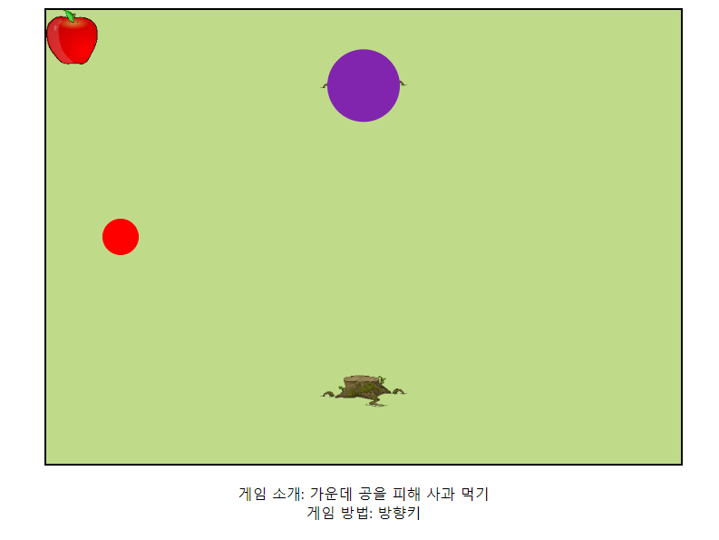
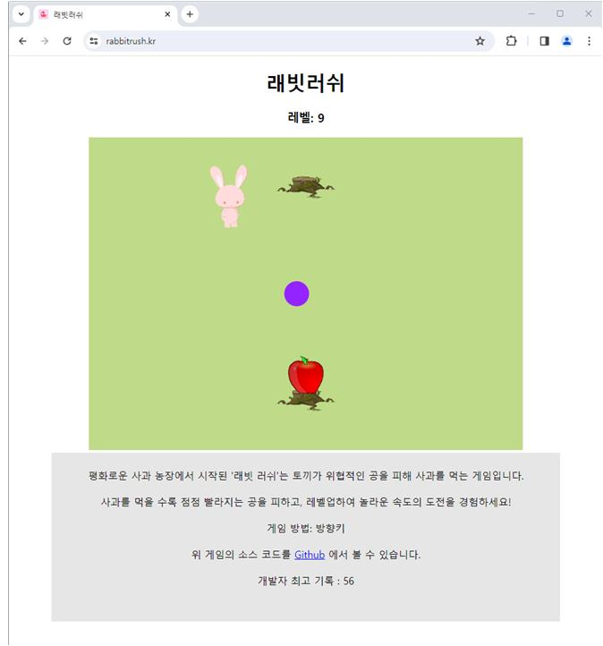

## 지난 번 문제점



충돌 함수를 작성하던 중 이미지를 움직이는 부분이 잘못 만들어져 사과와 플레이어가 충돌 시 이상한 곳으로 이동하게 되었다. 잘못 만들어진 충돌 함수를 알맞게 바꿔야 한다.

```javascript
// 충돌 감지 함수
function checkCollision(playerX, playerY, playerWidth, playerHeight, enemyX, enemyY, enemyRadius) {
	const distX = Math.abs(playerX - enemyX - enemyRadius);
	const distY = Math.abs(playerY - enemyY - enemyRadius);
	
	if (distX > (playerWidth / 2 + enemyRadius)) return false;
	if (distY > (playerHeight / 2 + enemyRadius)) return false;
	
	if (distX + enemyRadius <= playerWidth/2) return true;
	if (distY + enemyRadius <= playerHeight/2) return true;
	
	const dx = distX - playerWidth / 2;
	const dy = distY - playerHeight / 2;
	return (dx * dx + dy * dy <= (enemyRadius * enemyRadius));
}
```

플레이어와 오브젝트(적 공, 사과)의 위치, 크기와 반지름을 입력 받는 함수를 만든다.

이후 적 공과 플레이어의 구별을 쉽게 하기 위해 플레이어 또한 토끼 이미지로 변경한다.

```javascript
// 플레이어 이미지 객체
const playerImage = new Image();
playerImage.src = "rabbit.png"; // 플레이어 이미지 파일 경로

// 플레이어 이미지 초기 위치
let playerX = canvas.width / 2;
let playerY = canvas.height / 6;

// 플레이어 이미지 그리기 함수
const playerWidth = 60;
const playerHeight = 100;
function drawPlayer() {
ctx.drawImage(playerImage, playerX-playerWidth/2, playerY-playerHeight/2, playerWidth, playerHeight);
}
```

이렇게 만들어진 `drawPlayer()`를 통해 플레이어를 토끼의 이미지로 만들 수 있다. 이후  플레이어가  적 공과 사과에 부딪혔을 때 각각의 이벤트가 일어날 수 있게 만들어 주면 된다.

```javascript
// 공 충돌 감지
if (checkCollision(playerX, playerY, playerWidth, playerHeight, enemy_x, enemy_y, ballRadius)) {
	// 충돌 시 초기화
	level = 1;
	ballSpeed = 200;
	playerX = canvas.width / 2;
	playerY = canvas.height / 6;
	enemy_x = canvas.width / 2;
	enemy_y = canvas.height / 2;
	
	CollisionNum = 0;
	MoveApple = 0;
	
	// 레벨 표시 업데이트
	document.getElementById("level").innerHTML = "레벨: " + level;
}

// 사과 충돌 감지
if (checkCollision(playerX, playerY, playerWidth, playerHeight, canvas.width/2 - apple_x/2, canvas.height-120-apple_y/2, apple_x) && CollisionNum==0) {
	// 충돌 시 레벨 증가 및 속도 증가
	level++;
	if (ballSpeed>0) {
		ballSpeed += 80;
	}
	else {
	ballSpeed -= 80;
	}
	
	// 충돌 시 사과 위치 결정 변수 증가
	CollisionNum++;
	
	// 사과 이동 변수 변경
	MoveApple = 340;
	
	// 레벨 업데이트
	document.getElementById("level").textContent = "레벨: " + level;
}
else if (checkCollision(playerX+playerWidth, playerY+playerHeight, playerWidth, playerHeight, canvas.width/2 - apple_x/2, 120-apple_y/2, apple_x) && CollisionNum==1) {
	level++;
	if (ballSpeed>0) {
		ballSpeed += 80;
	}
	else {
		ballSpeed -= 80;
	}
	
	// 충돌 시 사과 위치 결정 변수 감소
	CollisionNum -= 1;
	
	// 사과 이동 변수 변경
	MoveApple = 0;
	
	document.getElementById("level").textContent = "레벨: " + level;
}
```

각각 적 공, 사과가 위 or 아래 일 때 충돌 함수를 적용해 문제를 해결한 모습이다. 


## 게임 프레임 문제 개선

먼저, 현재 내 모니터는 144Hz를 사용하고 있다. 게임이 잘 돌아가는 것을 확인하고 다른 문제가 없나 확인하던 중, 60Hz 환경에서 게임이 약 2배 느려지는 걸 알게 되었다.

나는 게임을 `AttackBall()` 함수를 통해 실행시키고 `requestAnimationFrame(AttackBall);` 를 이용해 게임을 반복 실행시키고 있었는데, 이것이 모니터의 새로 고침 빈도를 따라가고 있어 문제가 생긴 것이었다.

```javascript
// 사과 위치 변수
let MoveApple = 0;

// 게임 루프 제어 변수
let lastFrameTime = 0;

function AttackBall(timestamp) {
	// ... (생략)
	
	// 시간 간격 계산
	const deltaTime = (timestamp - lastFrameTime) / 1000; // 초 단위로 변환
	
	// 게임 로직 업데이트
	updateGameLogic(deltaTime);
	
	// 다음 프레임 요청
	requestAnimationFrame(AttackBall);
}

// 게임 로직 업데이트 함수
function updateGameLogic(deltaTime) {
	// ... 기존 AttackBall() 내용과 동일
	
	// 플레이어 이동
	movePlayer(deltaTime);
	
	// 마지막 프레임 시간 갱신
	lastFrameTime = performance.now();
}
```

위 과정을 통해 게임 로직 함수를 새로 만들어 게임을 프레임 단위가 아닌 초 단위로 변경할 수 있었다.


## 추가 개편

좀 더 게임을 재밌게 즐기기 위한 개편이 많이 필요하다. 그중 먼저 필요해 보였던 게임 시작의 역할과 방향키를 눌렀을 때 스크롤 방지, 우클릭 방지를 추가했다.

```html
<!DOCTYPE html>
<body>
<!-- 캔버스 앞에 위치할 박스 -->
<div class="box" id="textBox">
	<p>이곳으로 움직여 시작</p>
</div>
<script>
	function movePlayer(deltaTime) {
		// ... (기존과 동일)
			
		// 캐릭터가 시작으로 이동하면 텍스트 없애기
		if (newPlayerY > canvas.height / 2 - playerHeight/2 + 20) {
			hideText();
			playerX = newPlayerX;
			playerY = newPlayerY;
		}
	}
		
	function hideText() {
		// 텍스트를 감싸고 있는 <p> 요소를 가져옴
		const textElement = document.querySelector(".box p");
			
		// 텍스트가 있는지 확인하고 숨기기
		if (textElement) {
			textElement.style.display = "none";
		}
	}
		
	// 방향키 스크롤 방지
	window.addEventListener('keydown', function (e) {
		// 눌린 키가 화살표 키인지 확인
		if (['ArrowUp', 'ArrowDown', 'ArrowLeft', 'ArrowRight'].includes(e.key)) {
			e.preventDefault(); // 기본 동작 방지 (스크롤)
		}
	});
		
	// 우클릭 막기
	document.addEventListener('contextmenu', function (e) {
		e.preventDefault();
	});
</script>
</body>
```


## 도메인 구매 및 사이트 설립

여태까지의 과정을 통해 만든 게임을 보다 많은 사람이 즐겨볼 수 있고, 또 나도 게임의 피드백을 받기 위해 `rabbitrush.kr` 이라는 도메인을 구매했다.

(깃허브 페이지의 도메인을 커스텀 하는 방법은 [깃허브 공식 문서](https://docs.github.com/en/pages/configuring-a-custom-domain-for-your-github-pages-site/about-custom-domains-and-github-pages)를 참조 바란다.)

이 게임의 이름은 래빗러쉬(rabbitrush)이며, 앞으로도 관심이 식지 않는 한 게임의 업데이트를 지속할 예정이다. 관심이 있다면 [래빗러쉬 사이트](https://rabbitrush.kr)에 들어가 게임을 즐겨주고 피드백도 남겨주면 감사할 것이다.

- 게임 화면 예시


